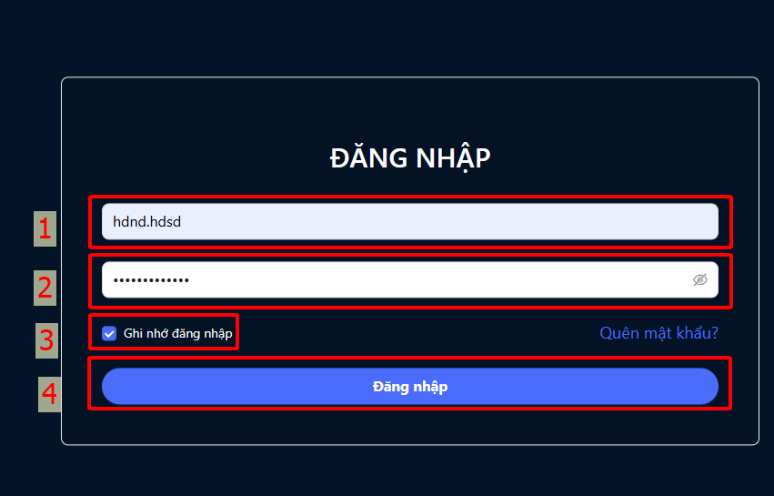
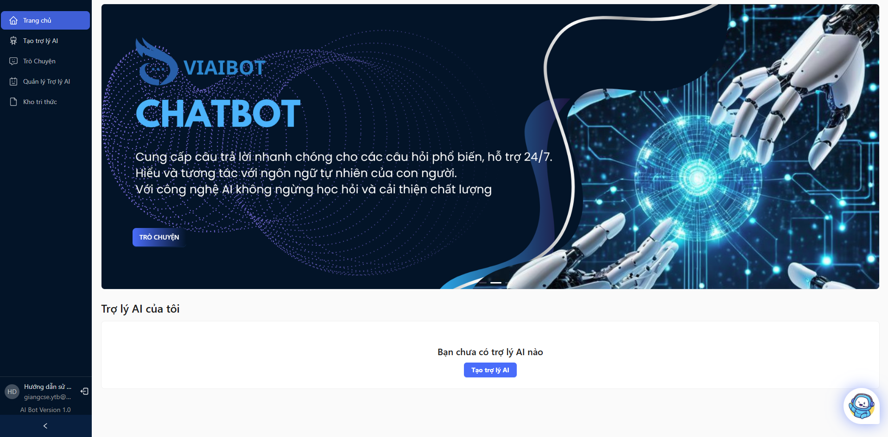
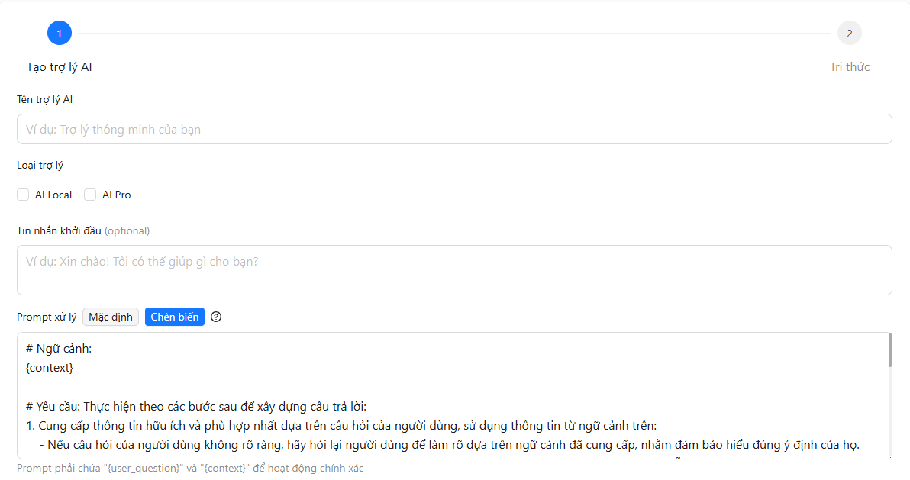
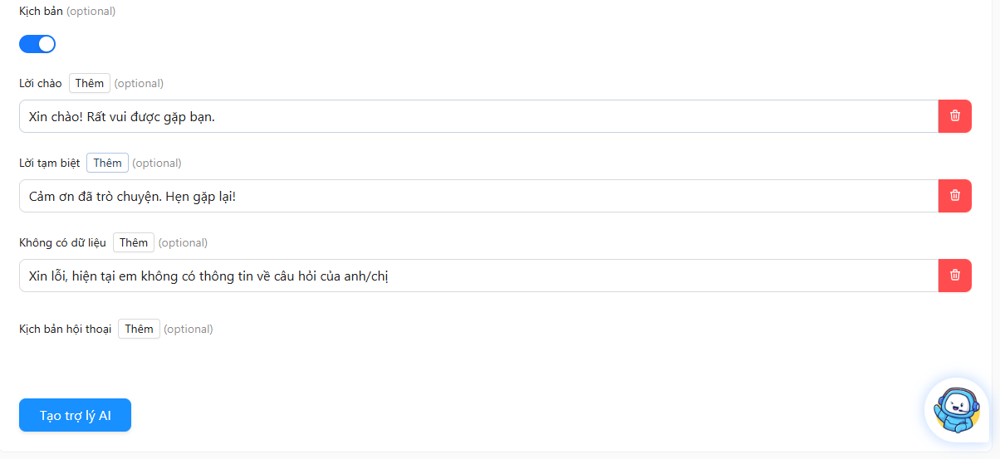

# HƯỚNG DẪN SỬ DỤNG CHATBOT AI

## 1. Hướng dẫn đăng nhập sử dụng hệ thống
- Truy cập vào trang web của hệ thống tại địa chỉ: [https://aibot.vnptvinhlong.vn](https://aibot.vnptvinhlong.vn)
- Nhập tên đăng nhập[1] và mật khẩu[2] được cung cấp, chọn `Ghi nhớ đăng nhập` để lần truy cập sau không cần phải đăng nhập lại. Nhấn nút `đăng nhập`[4] để truy cập sử dụng hệ thống.

Sau khi đăng nhập thành công, giao diện trang chủ của hệ thống sẽ hiển thị như hình dưới đây:

Trong đó:
1. Thanh menu điều hướng: 
    - Trang chủ
    - Tạo trợ lý AI
    - Trò chuyện
    - Quản lý Trợ lý AI
    - Kho tri thức
2. Khu vực làm việc chính: Hiển thị danh sách các chatbot được tạo.

## 2. Hướng dẫn tạo trợ lý AI
Để tạo một trợ lý AI mới, người dùng thực hiện các bước sau:
1. Chọn mục `Tạo trợ lý AI` trên thanh menu điều hướng (hoặc nút `Tạo trợ lý AI` trên giao diện trang chủ nếu chưa có trợ lý ảo AI nào được tạo).
2. Nhập các thông tin cần thiết:
    - Tên trợ lý AI: Đặt tên cho trợ lý AI của bạn.
    - Loại trợ lý: Chọn loại trợ lý phù hợp với mục đích sử dụng (Khuyến nghị nên chọn cả `AI Local` và `AI Pro`).
    - Tin nhắn khởi đầu (Không bắt buộc): Đây là tin nhắn chào hỏi khi người dùng bắt đầu cuộc trò chuyện với trợ lý AI. 
    - Prompt xử lý mặc định (Không bắt buộc): Đây là câu lệnh mặc định để hướng dẫn trợ lý AI trong quá trình trả lời câu hỏi. __Giữ nguyên nếu người dùng không có yêu cầu đặc biệt hoặc chưa biết cách viết system prompt.__
    - Kịch bản (Không bắt buộc): Đây là các tình huống hoặc kịch bản cụ thể mà trợ lý AI sẽ xử lý. __Giữ nguyên nếu người dùng không có yêu cầu đặc biệt.__

3. Nhấn nút `Tạo trợ lý AI` để hoàn tất quá trình tạo trợ lý AI.

