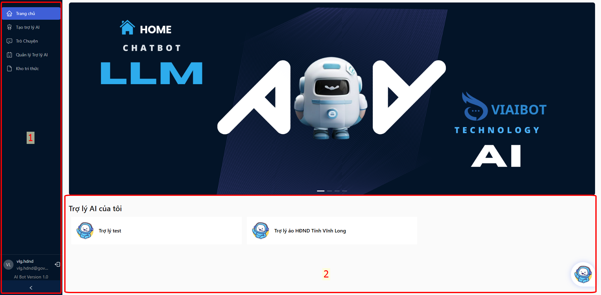
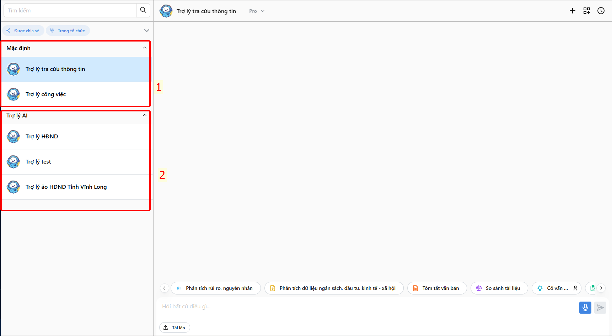
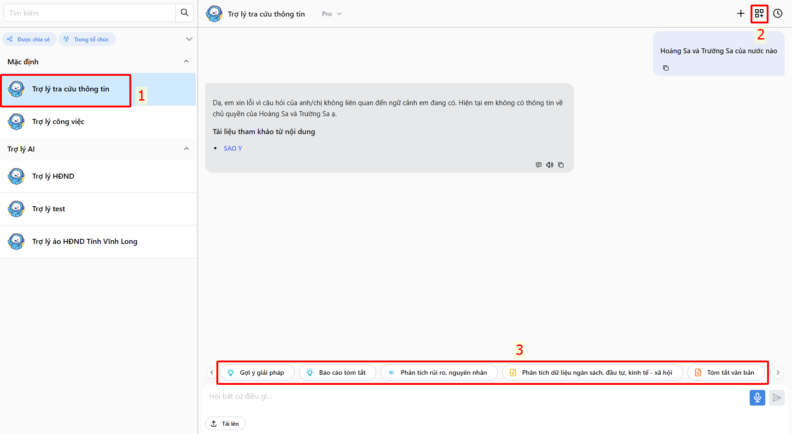
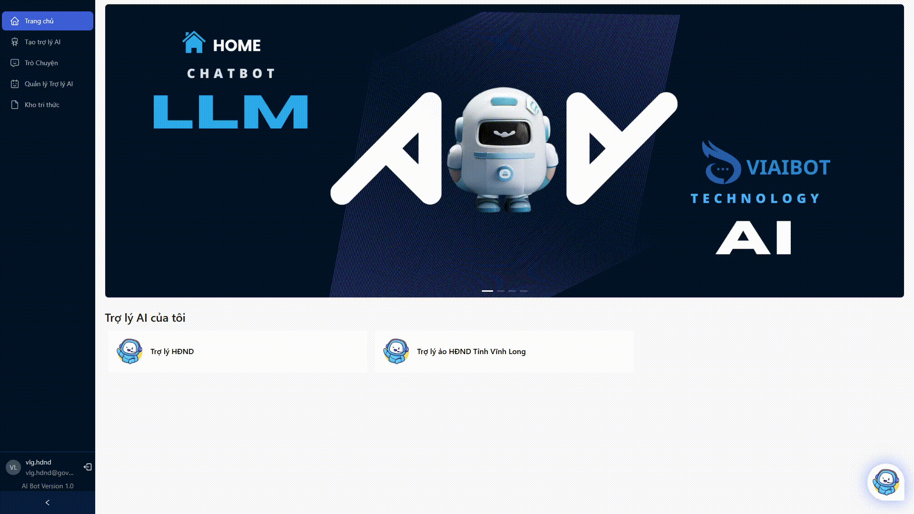
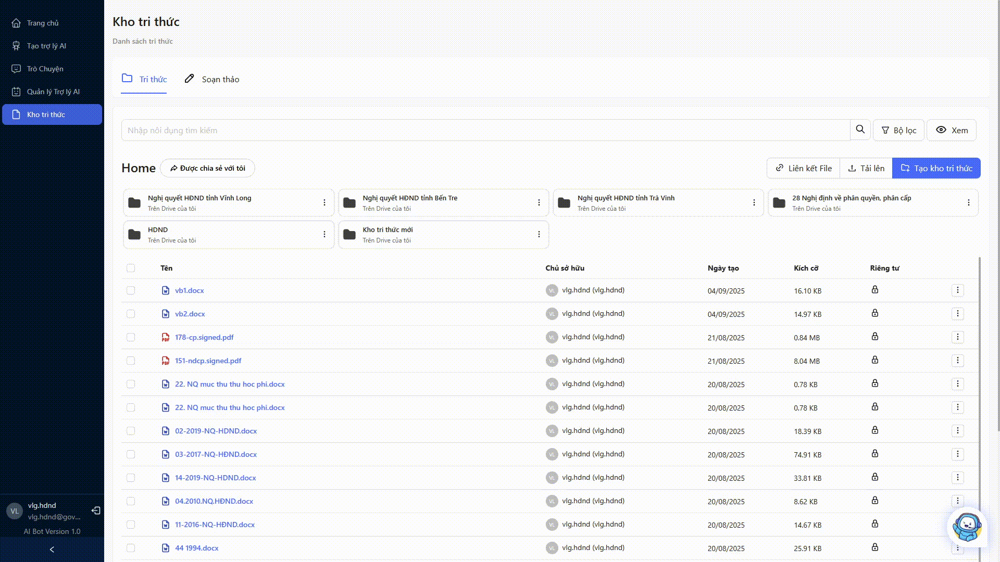
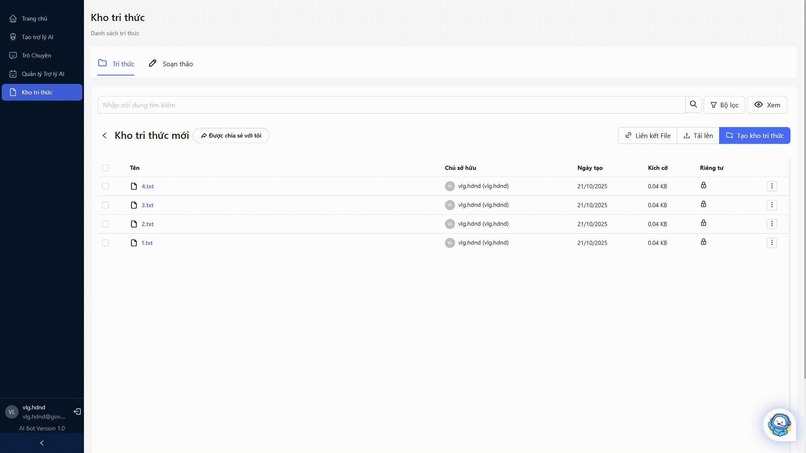

# HƯỚNG DẪN SỬ DỤNG HỆ THỐNG CHATBOT HỖ TRỢ TRA CỨU THÔNG TIN VIAIBOT (DÀNH CHO IT)
---
## Mục lục
* TOC
{:toc}
---

## 1. Trang chủ
Trang chủ gồm 2 phần chính: Thanh điều hướng (1) và khu vực hiển thị nội dung (2).

1. Thanh điều hướng: 
   - Trang chủ: Hiển thị danh sách các chatbot được tạo
   - Tạo trợ lý AI: Trang tạo mới trợ lý AI
   - Quản lý trợ lý AI: Trang quản lý các trợ lý AI đã tạo
   - Kho tri thức: Chuyển đến trang quản lý kho tri thức
   - Hồ sơ: Quản lý hồ sơ người dùng
   - Đăng xuất: Đăng xuất khỏi hệ thống

2. Khu vực hiển thị nội dung: Hiển thị danh sách các chatbot được tạo bởi người dùng.

## 2. Trò chuyện

- Trong phần Trò chuyện, ở bên trái phần nội dung là khu vực hiển thị danh sách các trợ lý AI Mặc định có sẵn và các trợ lý AI đã được tạo. Người dùng có thể chọn một trợ lý AI để bắt đầu trò chuyện.

    

1. Trợ lý AI __Mặc định__: Là trợ lý AI được hệ thống tạo sẵn để người dùng có thể thử nghiệm các tính năng của hệ thống. Trợ lý AI Mặc định sử dụng mô hình AI Pro và có thể truy cập toàn bộ tri thức mà người dùng cung cấp. Ngoài ra, người dùng có thể tạo thêm các tính năng bổ sung (phím tắt) cho trợ lý AI Mặc định này.

    

Các bước để tạo tính năng mới như sau:
- Bước 1: Nhấn nút Tạo tính năng mới (2) trên ảnh.
- Bước 2: Nhập tên tính năng, chọn loại tính năng và điền prompt xử lý (nếu có yêu cầu khác so với prompt mặc định).

    

- Bước 3: Nhấn nút Tạo để hoàn tất việc tạo tính năng mới.

Để sử dụng tính năng đã tạo, người dùng chỉ cần nhấn vào tên tính năng trong danh sách tính năng (3) và chọn file tri thức cần sử dụng liên quan đến tính năng đó. Ngoài ra người dùng có thể chỉnh sửa hoặc xóa tính năng đã tạo bằng cách nhấn vào biểu tượng __bút chì__ để chỉnh sửa hoặc biểu tượng __thùng rác__ để xóa tính năng.

## 3. Tạo trợ lý AI

Tạo mới trợ lý AI bao gồm các bước sau:
1. Điền thông tin trợ lý AI:
   - Avatar: Chọn ảnh đại diện cho trợ lý AI
   - Tên trợ lý AI: Nhập tên cho trợ lý AI
   - Loại trợ lý AI: AI Local - Chạy mô hình trên máy chủ nội bộ, AI Pro - Chạy mô hình trên đám mây VNPT (Khuyến nghị sử dụng AI Pro).
   - Tin nhắn khởi đầu: Nhập tin nhắn khởi đầu cho trợ lý AI
   - Prompt xử lý: Đây là phần nhập prompt để xử lý câu hỏi của người dùng. Người dùng có thể tham khảo các prompt mẫu được cung cấp sẵn hoặc tự tạo prompt riêng. Prompt phải đảm bảo có 2 bến là `{context}` và `{user_question}`. 
     - `{context}`: Chứa thông tin tri thức liên quan đến câu hỏi của người dùng.
     - `{user_question}`: Chứa câu hỏi của người dùng.
   - Cấu hình kịch bản: Bật hoặc tắt cấu hình kịch bản (có thể bỏ qua). Đây là phần cấu hình các bước xử lý câu hỏi của người dùng trả lời theo kịch bản đã được thiết lập sẵn để trợ lý AI trả lời chính xác hơn, tránh các trường hợp trả lời sai lệch.

2. Chọn tri thức cho trợ lý AI:
   Tại đây, người dùng có thể chọn các tri thức cần thiết từ kho tri thức hoặc tải lên tri thức mới để trợ lý AI có thể sử dụng trong quá trình trả lời câu hỏi của người dùng. Người dùng có thể chọn từng tri thức hoặc chọn tất cả tri thức trong kho tri thức.

Sau khi chọn xong, nhấn nút Thêm X tri thức để huấn luyện trợ lý AI với các tri thức đã chọn.

## 4. Quản lý trợ lý AI

Chọn trợ lý AI cần quản lý từ danh sách trong phần Quản lý trợ lý AI. Tại đây, người dùng có thể thực hiện các thao tác sau:
1. Quản lý: Xem thông tin chi tiết của trợ lý AI, bao gồm trạng thái huấn luyện,...
2. Hồ sơ: Chỉnh sửa thông tin trợ lý AI như tên, avatar, tin nhắn khởi đầu, prompt xử lý, cấu hình kịch bản.
3. Tri thức: Xem danh sách tri thức đã được thêm vào trợ lý AI, xóa tri thức không cần thiết hoặc thêm tri thức mới từ kho tri thức.
4. Tích hợp: Cung cấp các thông tin cần thiết để tích hợp trợ lý AI vào các nền tảng website.
5. Lịch sử trò chuyện: Xem lịch sử trò chuyện của trợ lý AI với người dùng.

## 5. Kho tri thức

Kho tri thức là nơi người dùng quản lý các tri thức được sử dụng để huấn luyện trợ lý AI.
- Quản lý kho tri thức (Thư mục): Tạo, sửa, xóa các thư mục để tổ chức tri thức một cách hợp lý.

    

- Thêm/Sửa/Xóa tri thức: Người dùng có thể thêm mới, sửa hoặc xóa các tri thức trong kho tri thức.

    
    
    Soạn thảo tri thức trực tiếp trên hệ thống:

    

    Xóa tri thức:

    

- Di chuyển tri thức giữa các thư mục.

    

- Chia sẻ tri thức.

    