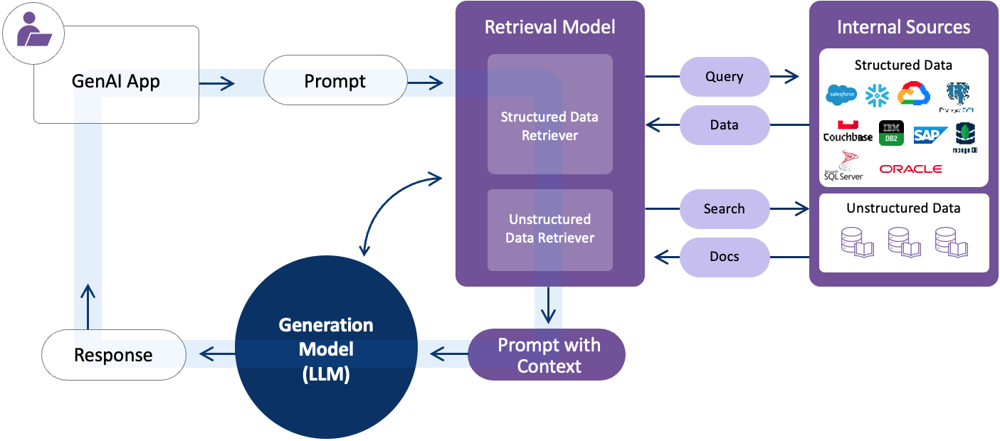
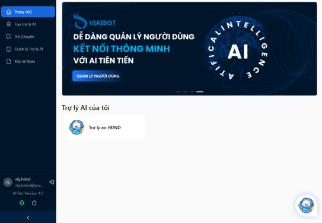
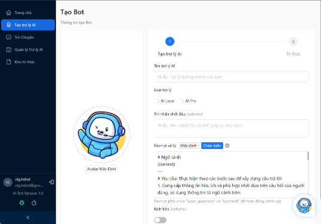
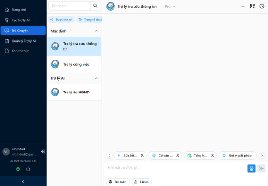
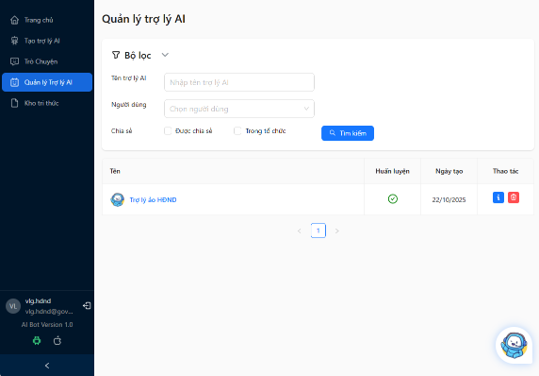
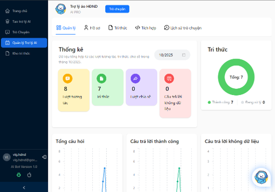
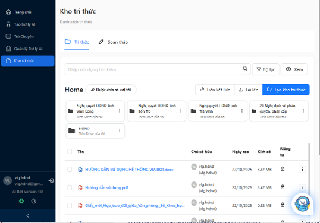

# HƯỚNG DẪN SỬ DỤNG TRỢ LÝ ẢO VIAIBOT

* TOC
{:toc}
---

## 1. Giới thiệu Generative AI (Gen AI), Large Language Model (LLM), Retrieval-Augmented Generation (RAG)

### Generative AI (Gen AI)
GenAI (Generative AI - Trí tuệ nhân tạo tạo sinh)
Đây là một lĩnh vực của trí tuệ nhân tạo, tập trung vào việc tạo ra nội dung mới mà không chỉ đơn thuần là phân tích hay xử lý dữ liệu có sẵn. GenAI có thể tạo ra văn bản, hình ảnh, mã code, âm thanh, video... bằng cách học các mẫu (patterns) từ một lượng lớn dữ liệu huấn luyện.

### Large Language Model (LLM)
Đây là một loại GenAI chuyên biệt về ngôn ngữ. LLM được huấn luyện trên một kho dữ liệu văn bản khổng lồ (ví dụ: phần lớn nội dung trên internet). Nhờ vậy, nó có khả năng hiểu sâu sắc ngữ cảnh, tóm tắt, dịch thuật, trả lời câu hỏi và tạo ra văn bản một cách tự nhiên và mạch lạc.
Ví dụ: GPT-4 (dùng trong ChatGPT), Gemini (dùng trong Google Bard/Gemini), Llama (của Meta).

### Retrieval-Augmented Generation (RAG)
RAG (Retrieval-Augmented Generation - Tạo sinh tăng cường truy xuất)
Đây là một kỹ thuật hoặc kiến trúc được sử dụng để cải thiện hiệu suất của LLM. RAG kết hợp khả năng tạo sinh văn bản của LLM với một hệ thống truy xuất thông tin (như một cơ sở dữ liệu riêng, tài liệu nội bộ, hoặc công cụ tìm kiếm).
Mục đích: Khi LLM nhận một câu hỏi, thay vì chỉ dựa vào kiến thức "tĩnh" (kiến thức nó có tại thời điểm huấn luyện), RAG sẽ chủ động truy xuất thông tin liên quan, cập nhật từ một nguồn bên ngoài. Sau đó, nó cung cấp thông tin này cho LLM làm "ngữ cảnh" để tạo ra câu trả lời chính xác hơn, đáng tin cậy hơn và giảm thiểu việc "ảo giác" (bịa thông tin).

### Mối liên hệ giữa GenAI, LLM và RAG

* Generative AI:
Nền tảng chung dựa trên LLM để tạo nội dung đa dạng
* LLM là Nền Tảng:
Cung cấp khả năng ngôn ngữ mạnh nhưng kiến thức tĩnh
* RAG Bổ Sung:
Thêm kiến thức động từ nguồn bên ngoài, vượt qua hạn chế
* VIAIBOT:
Là một GenAI (RAG) sử dụng LLM để tạo nội dung dựa trên kiến thức được cung cấp.

## 2. Giới thiệu tổng quan VIAIBOT

### Các tính năng chính
1. Trang chủ
2. Tạo trợ lý AI
3. Trò chuyện
4. Quản lý Trợ lý AI
5. Kho tri thức

### Trang chủ
Hiển thị danh sách các Trợ lý AI được tạo bởi người dung.

### Tạo trợ lý AI
Tạo Trợ lý AI và thêm tri thức cho trợ lý.

### Trò chuyện
Nơi người dung trò chuyện với Trợ lý AI.
Mặc định: Đây là các trợ lý mặc định có sẵn, người dùng không thể xóa, sửa.
Trợ lý AI: Đây là các trợ lý do người dùng tạo, có thể xóa hoặc sửa thông tin trợ lý cũng như quản lý kho tri thức.

### Quản lý Trợ lý AI
Quản lý các trợ lý AI được tạo bởi người dùng

Chi tiết các mục:
- Quản lý: Các biểu đồ thống kê của trợ lý.
- Hồ sơ: Thông tin cơ bản của trợ lý, prompt hướng dẫn kịch bản.
- Tri thức: Quản lý kho tri thức của trợ lý.
- Tích hợp: Tích hợp vào website.
- Lịch sử trò chuyện: Lịch sử trò chuyện của người dùng với trợ lý.

### Kho tri thức
Quản lý kho tri thức: Thêm/di chuyển/xóa kho tri thức.
Quản lý tri thức: Thêm (soạn thảo/tải lên/nhập từ hệ thống khác)/xóa/di chuyển/chia sẻ tri thức với người dung khác.
Tìm kiếm tri thức: Tìm với nội dung/Tên file,…

## 3. Workflows

1. [Tạo và sử dụng trợ lý AI](/aibot_hdsd/docs/LUONG_1)
2. [Tra cứu tài liệu](/aibot_hdsd/docs/LUONG_2)
3. [Tạo và sử dụng tính năng](/aibot_hdsd/docs/LUONG_3)
4. [Tạo trợ lý AI tùy biến theo mục đích sử dụng](/aibot_hdsd/docs/LUONG_4)
5. [Thêm tri thức mới cho trợ lý ảo](/aibot_hdsd/docs/LUONG_5)
6. [Tìm kiếm thông tin trên internet](/aibot_hdsd/docs/LUONG_6)
6. [Chat Ngoài kho tri thức](/aibot_hdsd/docs/LUONG_7)
