# HƯỚNG DẪN SỬ DỤNG HỆ THÔNG CHATBOT HỖ TRỢ TRA CỨU THÔNG TIN VIAIBOT (DÀNH CHO NHÓM NGƯỜI DÙNG)

> Quét mã QR để xem video hướng dẫn và tải ứng dụng trên các nền tảng:

* TOC
{:toc}
---

## Đăng nhập

Người dùng truy cập vào [https://aibot\.vnptvinhlong\.vn/dang\-nhap](https://aibot.vnptvinhlong.vn/dang-nhap) để tiến hành đăng nhập\. Nhập thông tin tên tài khoản và mật khẩu đã được cung cấp\.

## Quản lý trợ lý AI 

### Quản lý trợ lý AI 

Mục đích: Cho phép người dùng quản lý trợ lý AI hỗ trợ cho công việc\. 

1. Thêm trợ lý AI

- Bước 1: Bấm tạo trợ lý AI trên thanh điều hướng để tạo trợ lý AI\.  
- Bước 2: Nhập thông tin cho trợ lý AI \(Tên, loại, tin nhắn khởi đầu, cấu hình kịch bản\) và bấm nút ‘Tạo trợ lý AI’
- Bước 3: Chọn các tri thức cần thiết cho trợ lý AI 
- Bước 4: Kiểm tra lại các tri thức và tiến hành huấn luyên bằng cách bấm vào nút “Huấn luyện” 
	- Chọn avatar để đổi avatar cho trợ lý AI
	- Nhập thông tin trợ lý AI 
	- Bật kịch bản để tiến hành cấu hình kích bản \(có thể bỏ qua\)
	- Bấm “Tạo trợ lý AI”
- Bước 5: Người dùng chọn các tri thức cần thiết hoặc có thể chọn thêm tất cả tri thức trong kho tri thức

	

- Người dùng tiến hành kiểm tra các trạng thái các tri thức và tiến hành huấn luyện\. Người dùng có thể thực hiện thao tác huấn luyện tại trang quản lý trợ lý AI sau khi các tri thức được xử lý xong\.

2. Danh sách trợ lý AI

	1. Cập nhật thông tin trợ lý AI

		

		Người dùng tiến hành điểu chỉnh các thông tin trợ lý AI và bấm nút “Cập nhật”

3. Xoá trợ lý AI.

	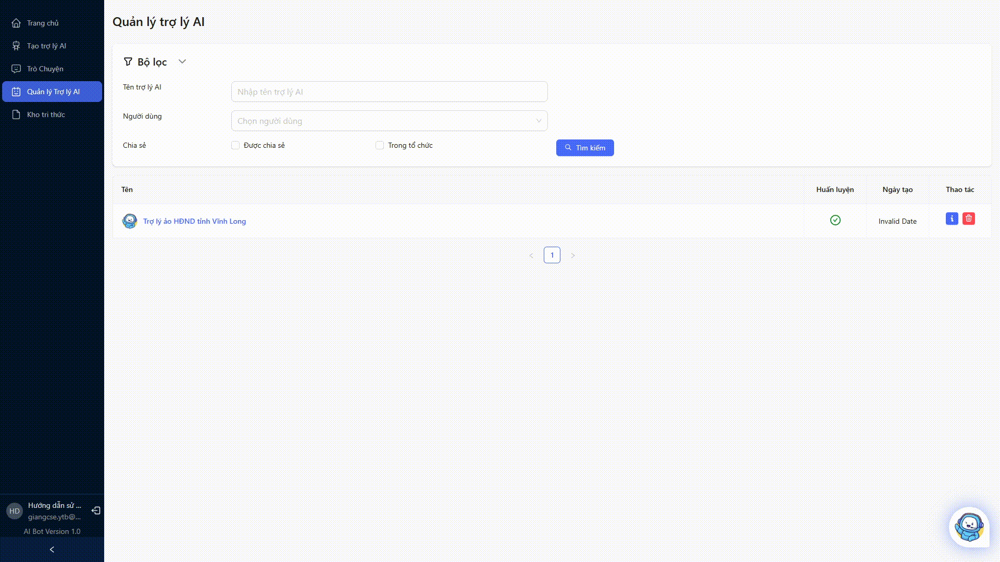

### Quản lý tri thức AI

1. Tải lên tri thức

	

2. Chọn Danh sách tri thức để thực hiện thêm tri thức từ kho tri thức tài khoản

	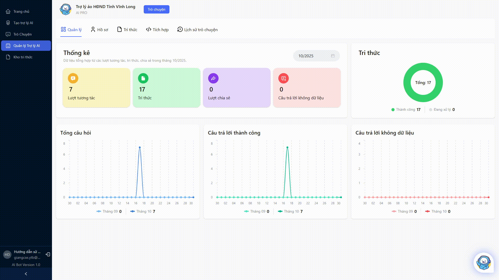

### Tích hợp

Mục đích dùng để tích hợp trợ lý vào trang web.
1. Truy cập vào tab Tích hợp trong trang quản lý trợ lý AI
2. Chọn thời hạn tích hợp
3. Sao chép đoạn mã và dán vào trang web cần tích hợp
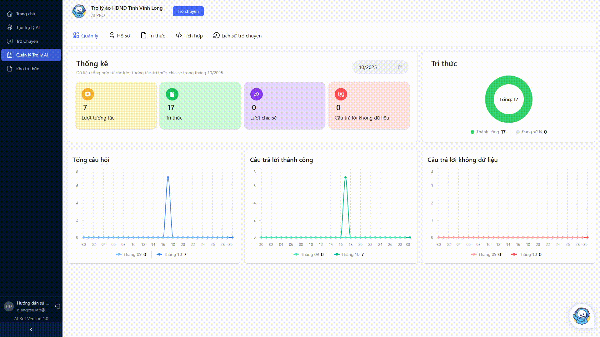

### Lịch sử trò chuyện

Xem lại lịch sử trò chuyện với trợ lý AI

## Kho tri thức

Mục đích: Cho phép người dùng quản lý kho tri thức hỗ trợ cho công việc\.
### Quản lý kho tri thức 

1. Tạo kho tri thức

	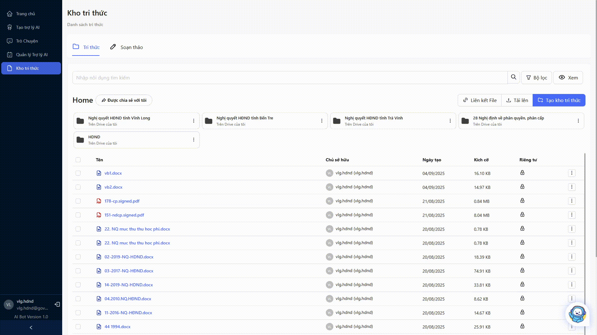

2. Cập nhật kho tri thức

	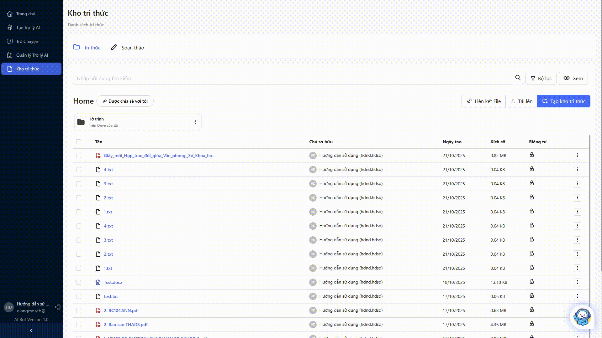

3. Xóa kho tri thức

	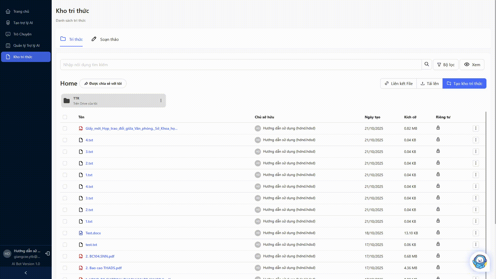

### Quản lý tri thức
1. Xóa tri thức

	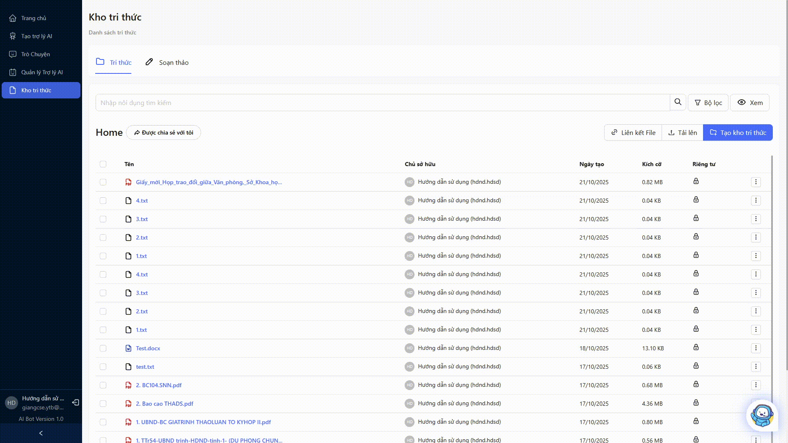

2. Soạn thảo tri thức

	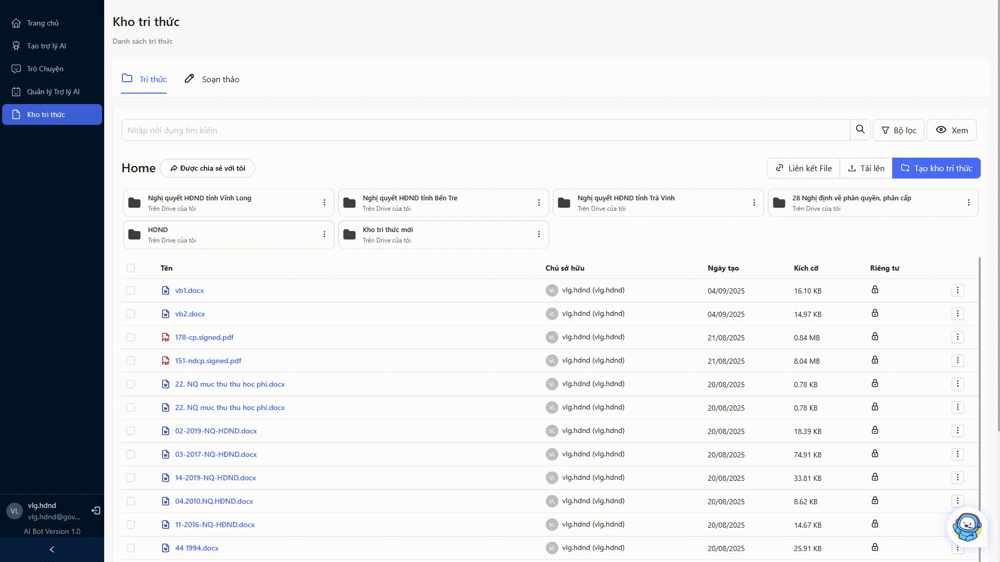

3. Di chuyển tri thức 

	

4. Chia sẻ tri thức

	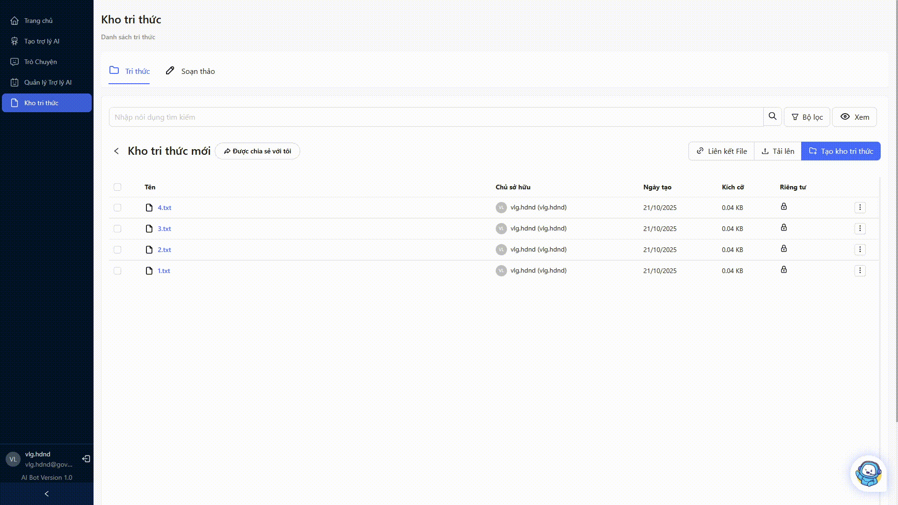

## Trò chuyện

Người dùng chọn trợ lý AI để tiến hành tra cứu thông tin

1. Tạo cuộc trò chuyện mới

	

2. Thêm tính năng 

	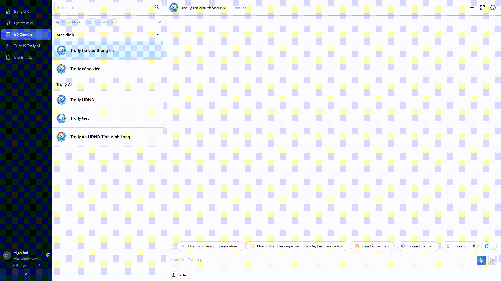

	\- Người dùng tiến hành nhập thông tin tính năng và bấm vào “Tạo” để thêm tính năng

	\- Tính năng thêm thành công

	\- Đặt chuột vào tính năng sẽ hiện các chức năng sửa, xóa

3. Sử dụng tính năng đã tạo

	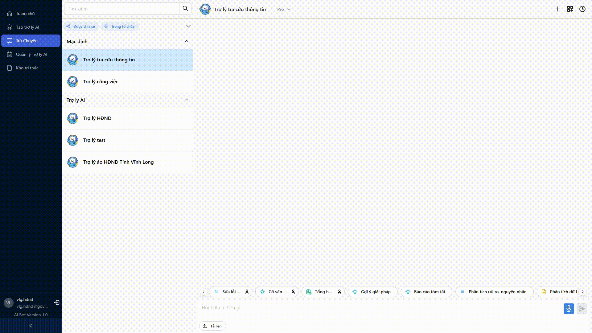

	\- Bấm chuột vào tính năng sẽ hiện ra bảng chọn file\. Chọn các file cần dùng và bấm xác nhận

4. Tra cứu thông tin từ tài liệu

	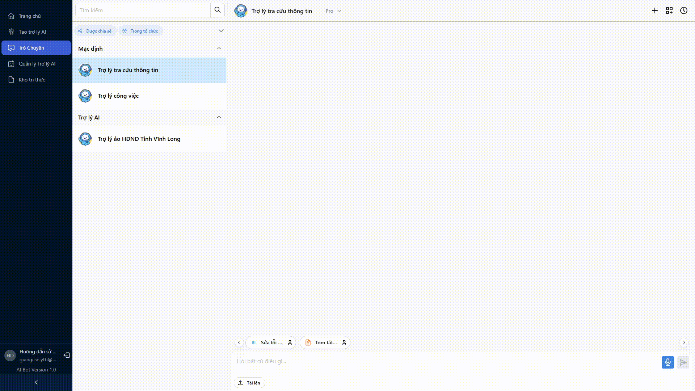

	\- Người dùng bấm vào nút tải lên và chọn tài liệu cần tra cứu thông tin

---
Publisher: {{ site.author.name }}

github: {{ site.social.github }}