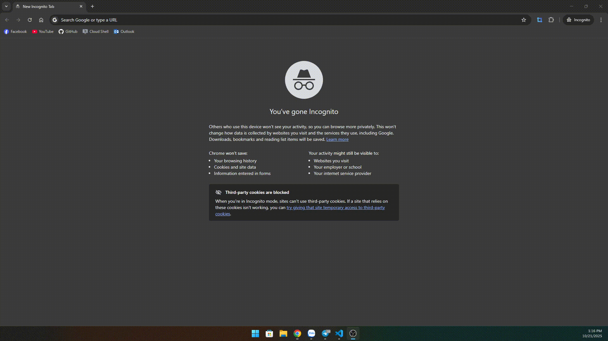
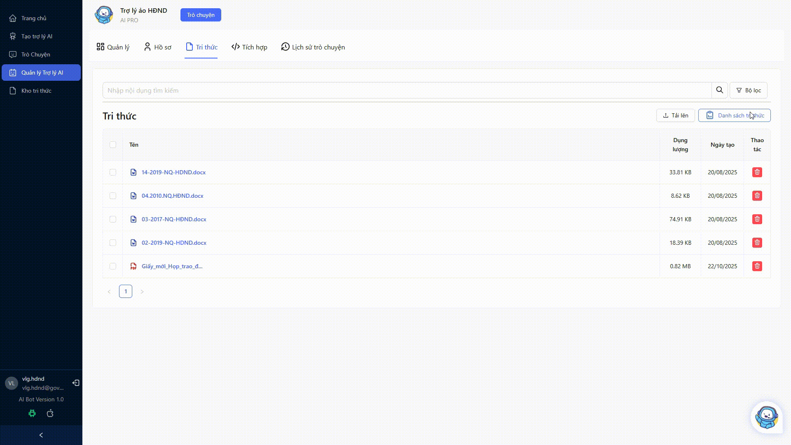

# THÊM TRI THỨC MỚI CHO TRỢ LÝ ẢO

## Mục lục
* TOC
{:toc}
---

## 1. Đăng nhập
Đăng nhập vào hệ thống tại địa chỉ [https://aibot.vnptvinhlong.vn/dang-nhap](https://aibot.vnptvinhlong.vn/dang-nhap)

## 2. Thêm tri thức mới
1. Vào mục Quản lý trợ lý AI
2. Chọn trợ lý AI cần thêm tri thức
3. Vào tab Tri thức
### 2.1. Tải lên tri thức

### 2.2. Chọn từ Danh sách tri thức

