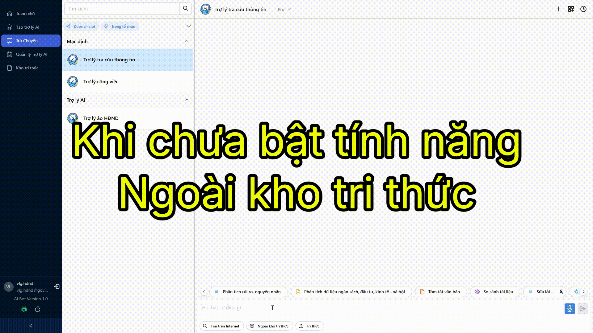

# TRÒ CHUYỆN NGOÀI KHO TRI THỨC

* TOC
{:toc}
---

> Người dùng bật tính năng này để sử dụng Trợ lý AI như một ChatGPT hoặc Gemini thông thường.
> Nếu bật tính năng này, Trợ lý AI sẽ sử dụng các thông tin ngoài kho tri thức để trả lời câu hỏi. Khi này, câu trả lời của trợ lý có thể chứa những thông tin đã cũ (do lúc huấn luyện mô hình LLM chưa có những thông tin mới nhất).

## 1. Đăng nhập
Đăng nhập vào hệ thống tại địa chỉ [https://aibot.vnptvinhlong.vn/dang-nhap](https://aibot.vnptvinhlong.vn/dang-nhap)

## 2. Bật tính năng Ngoài kho tri thức
Sau khi truy cập vào trò chuyện với Trợ lý AI, bật tính năng `Ngoài kho tri thức` trong phần nhập tin nhắn và sau đó nhập thông tin cần tìm kiếm, tóm tắt, hỏi đáp,...

